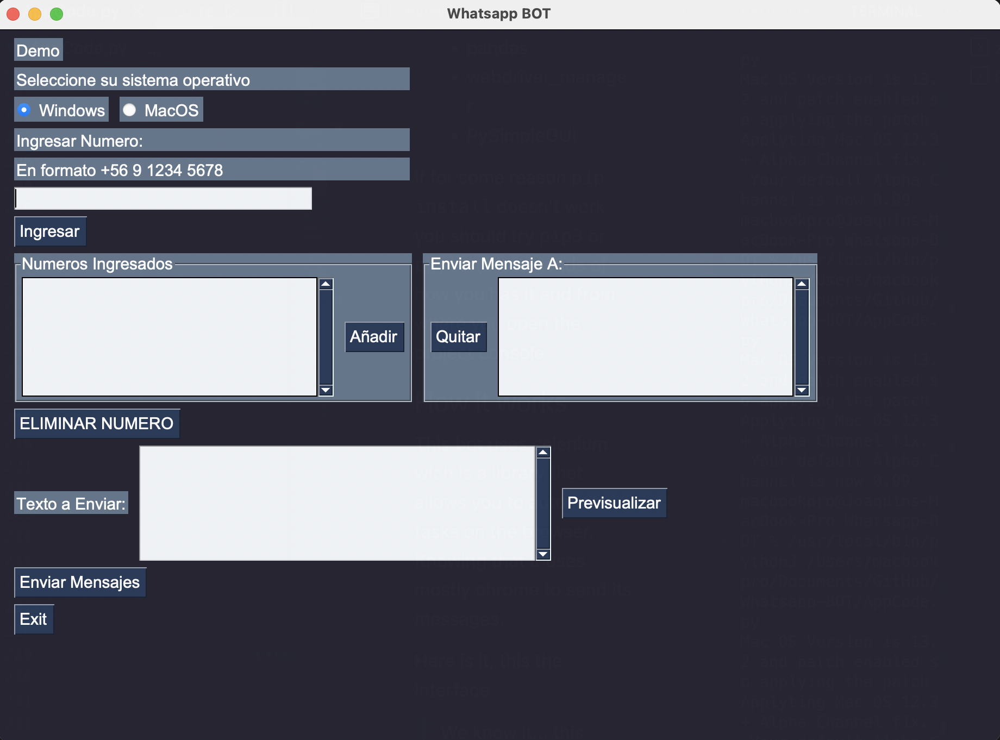

# Whatsapp Bot

This is a Whatsapp bot that allows you to send the same message to many people as you want.

First of all, the project was made on phyton and you will need these libraries so you have to use on the console `pip install` with the list below

- selenium 
- regex
- urbllib
- pandas
- webdriver_manager
- PySimpleGUI

if for some reason `pip install` doesn't work you should try `pip3` or `phyton3` it depends of how you has it and from where you open the project console

## How it works 
This bot uses selenium wich is a library that allows you to automate tasks on the browser. Knowing that it uses mostly chrome to send its messages. 

Here is it, this the interface 
> We know it... this is awful.. but we are working to improve it

    